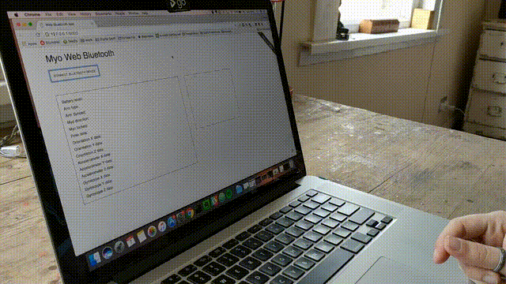

# Myo-web-bluetooth.js

Connect to the Myo armband using Web Bluetooth.



### Steps:

* Turn on your bluetooth.
* Visit [this page](https://charliegerard.github.io/myo-web-bluetooth.js/index.html)
* Click on the 'Connect' button.
* If no device is recognised, make sure the name of your Myo is the same one as me ("Myo").
* If the gestures are not recognised, make sure you execute the 'sync' gesture before connecting.


### How to use:

```javascript
window.onload = function(){

  let button = document.getElementById("connect");

  button.onclick = function(e){
    var myoController = new MyoWebBluetooth("Myo");
    myoController.connect();

    myoController.onStateChange(function(state){
      let batteryLevel = state.batteryLevel + '%';
      console.log(batteryLevel);
    });
  }
}
```

### Data available:

* Battery Level:

```javascript
  state.batteryLevel;
```

* Arm type:

```javascript
  //returns 'right' or 'left';
  state.armType;
```

* Arm synced:

```javascript
  state.armSynced;
```

* Myo direction:

```javascript
  // returns 'wrist' or 'elbow';
  state.myoDirection;
```

* Myo locked:

```javascript
  state.myoLocked;
```

* Orientation data:

```javascript
  state.orientation.x;
  state.orientation.y;
  state.orientation.z;
```

* Gyroscope data:

```javascript
  state.gyroscope.x;
  state.gyroscope.y;
  state.gyroscope.z;
```

* Accelerometer data:

```javascript
  state.accelerometer.x;
  state.accelerometer.y;
  state.accelerometer.z;
```

* Pose data:

```javascript
  // returns 'fist', 'wave in', 'wave out', 'fingers spread' or 'double tap';
  state.pose;
```

### Services and characteristics:

Available so far:

* Control Service
  * Command characteristic


* IMU Data Service
  * IMU Data characteristic


* EMG Data Service
  * EMG Data characteristic


* Battery Service
  * Battery level characteristic


* Classifier Service
  * Classifier event characteristic

### To do:
* Add images of poses for visual feedback.
* Make orientation data work with 3d model.
